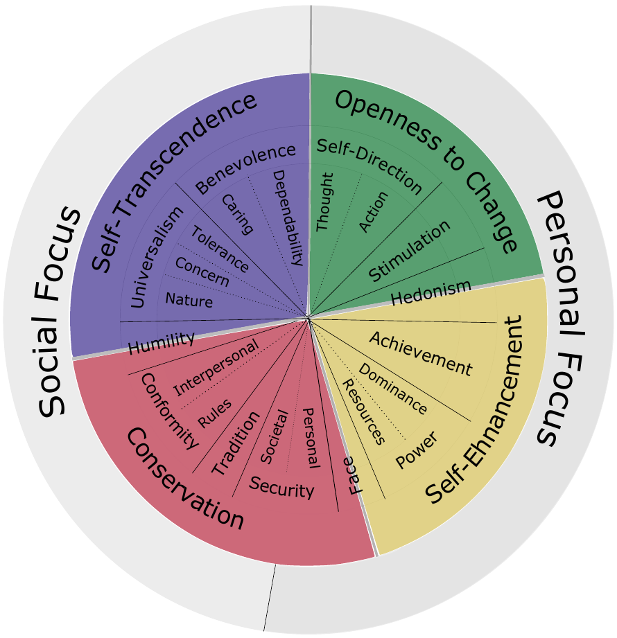
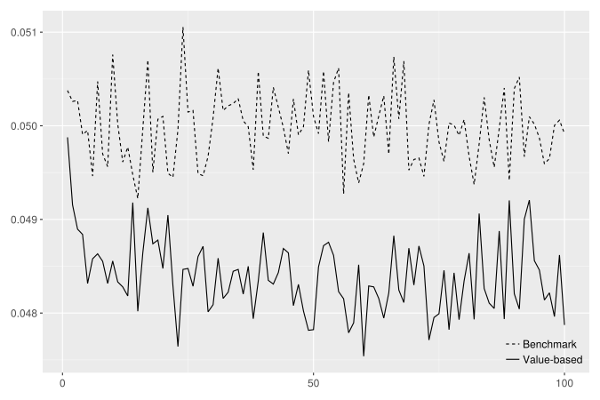
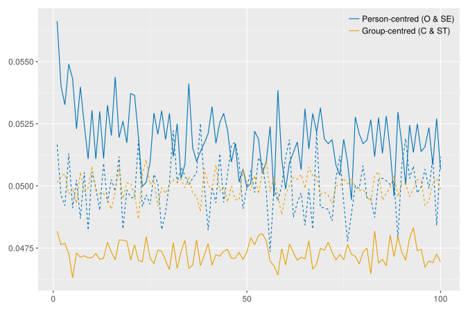
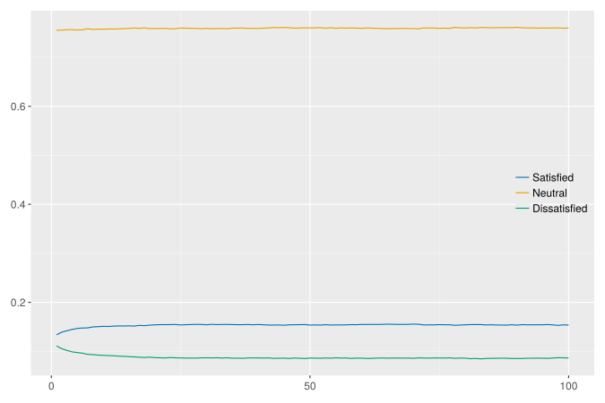
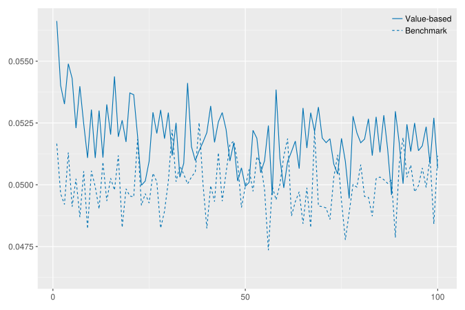
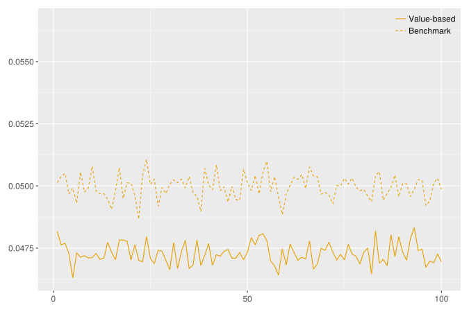

## How Schwartz values influence social networks in the workplace

*Frederik Banning, Marcin Czupryna, Bogumił Kamiński*

Glasgow, 07. September 2023

---

## Executive Summary

<!-- motivation -->
People's values determine  
*where and with whom*  
they want to work.\*

\*Terms and conditions apply.<!-- .element: style="font-size:0.6em" -->

<!-- model -->
ABM about *work-related social networks*

*Synthetic population* with *individual values*

Agents are nodes of a *directed graph*

Workgroup *satisfaction* depends on *network metrics*

Decision to *change network* based on satisfaction

*Exponential random graph model* for network connections

<!-- hypotheses -->
1. Value-based decision-making leads to *greater stability* of social networks at the workplace.
2. Agents with *person-centred* values *change* their networks *more often* than those with group-centred values.

We found **weak support** for our hypotheses.

<!-- Schwartz values -->
 <!-- .element: style="height:60vh" -->  
*Source: Adapted from Schwartz et al. (2012).* <!-- .element: style="font-size:16px" -->

---

## Data

### European Social Survey, Round 9 (2018-2020)

1. all participants from Poland (1500)
2. positive number of total work hours per week, pay as main source of income, Schwartz values available (1165)

$\Downarrow$

Synthetic population of 2999 agents with representative value distribution.

### Experiment with Polish students (October 2020 - June 2021)

- 258 students of economics, economic psychology, and psychology from three Polish universities
- random assignment into 35 groups of up to 10 members

- Questionnaire before and after semester
- asked to declare willingness to cooperate with other students from same group
- Schwartz values measured via 21-item Portrait Values Questionnaire

---

## Model

- Correlation of values with network measures
- Satisfaction rules and network change
- ERGM for new connections

### Authority and hub score

| Value | $s_{h}^{1,2}$ | $s_{a}^{1,2}$ |
| :---  | ---:          | ---:          |
| SD ST HE AC PO | -0.11 (0.09) 0.05 (0.48) 0.14 (0.03) -0.17 (0.01) -0.04 (0.54) |  0.06 (0.38) -0.08 (0.20) -0.15 (0.02) 0.16 (0.01) 0.07 (0.26)  |
<!--| Value | $s_{h}^{1,2}$ | $s_{a}^{1,2}$ |
| :---  | ---:          | ---:          |
| SD    | -0.11 (0.09)  |  0.06 (0.38)  |
| ST    |  0.05 (0.48)  | -0.08 (0.20)  |
| HE    |  0.14 (0.03)  | -0.15 (0.02)  |
| AC    | -0.17 (0.01)  |  0.16 (0.01)  |
| PO    | -0.04 (0.54)  |  0.07 (0.26)  |-->

### In-degree centrality

| Value | $s_{c}^{1,2}$ |
| :---  | ---:          |
| SE CO TR BE UN | -0.11 (0.51) -0.15 (0.37) 0.14 (0.41) 0.02 (0.92) -0.15 (0.36) |

### Decision rules for network change

| Value  | Satisfied | Dissatisfied |
| :---   | :---:     | :---:        |
| PO     | $s_a > \delta_a^u (1)$ | $s_a < \delta_a^d (1)$ |
| AC, SD | $s_a > \delta_a^u (2)$  and  $s_h < \delta_h^d (2)$ | $s_a < \delta_a^d (3)$  or  $s_h > \delta_h^u (3)$ |
| ST     | $s_a < \delta_a^d (2)$  and  $s_h > \delta_h^u (2)$ | $s_a > \delta_a^u (3)$  or  $s_h < \delta_h^d (3)$ |
| UN     | $s_c < \delta_c^d (4)$ | $s_c < \delta_c^u (4)$ |
| TR, CO | $s_c > \delta_c^u (5)$ | $s_c < \delta_c^d (5)$ |

### ERGM

|             | Estimated parameter values |
| :---        | :---: |
| edges mutual diff.h-t.PO diff.h-t.AC diff.h-t.ST diff.h-t.SD diff.h-t.UN diff.h-t.CO diff.h-t.TR | -0.62 (0.05)\*\*\* 1.06 (0.08)\*\*\* 0.05 (0.05) 0.31 (0.05)\*\*\* -0.08 (0.05) 0.18 (0.05)\*\*\* 0.18 (0.06)\*\* 0.06 (0.04) 0.13 (0.04)\*\* |
| AIC BIC Log Likelihood | 3822.92 3876.73 -1902.46 |
\*\*\*$p<0.001$; \*\*$p<0.01$; \*$p<0.05$ <!-- .element: style="font-size:16px" -->

---

## Preliminary results

## Hypotheses

1. Agent decision rules based on individual Schwartz values lead to **greater stability of social networks** at the workplace when compared to benchmark networks with decision rules not based on individual Schwartz values.
2. Agents driven by **person-centred** values **change** their social networks at the workplace **more often** than agents driven by group-centred values.

<figure>
	
	<figcaption>(a) Mean share of network changers per simulation step.</figcaption> <!-- .element: style="font-size:20px" -->
</figure>

<figure>
	
	<figcaption>(b) Mean share of network changers among person- (blue) and group-centred (yellow) agents.</figcaption> <!-- .element: style="font-size:20px" -->
</figure>

|  | $f$ | $f_{PC}$ | $f_{GC}$ |
| :--- | :---: | :---: | :---: |
| Benchmark Value-based | 4.949 4.791 | 4.948 5.141 | 4.947 4.682 |

The signs of the relevant differences support both hypotheses.

---

## Further steps

- Repeat the experiment for more robust data,
- use other synthetic populations,
- conduct systematic analysis with different parameter sets,
- formulate alternative decision rules for network building and satisfaction levels (e.g. satisfaction based on relative position in given social network),
- implement dynamics in networks without changers,
- ...

## Questions?

Please **ask** them here or **write us** an email.

Frederik Banning | *frederik.banning@rub.de*  
Marcin Czupryna | *czuprynm@uek.krakow.pl*  
Bogumił Kamiński | *bkamins@sgh.waw.pl*

**Thank you for your attention!**

---

## Additional slides

## Values

- Values are desirable goals that guide and motivate people's perceptions, judgments, attitudes, and actions
- Values determine what is important in life
- Everyone's value system is unique and hierarchical

*Hub score*: An agent is a good hub when they want to work with a lot of other agents with high authority scores.

*Authority score*: An agent is a good authority when a lot of other agents with high hub scores want to work with them.

*In-degree centrality*: A workgroup's centrality describes how widespread willingness to cooperate and work jointly are between its agents.

<figure>
	
	<figcaption>Satisfaction levels as share of overall population per simulation step.</figcaption> <!-- .element: style="font-size:20px" -->
</figure>

<figure>
	
	<figcaption>Mean share of network changers among person-centred agents.</figcaption> <!-- .element: style="font-size:20px" -->
</figure>

<figure>
	
	<figcaption>Mean share of network changers among group-centred agents.</figcaption> <!-- .element: style="font-size:20px" -->
</figure>
